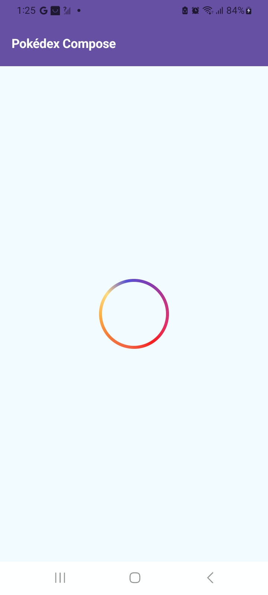
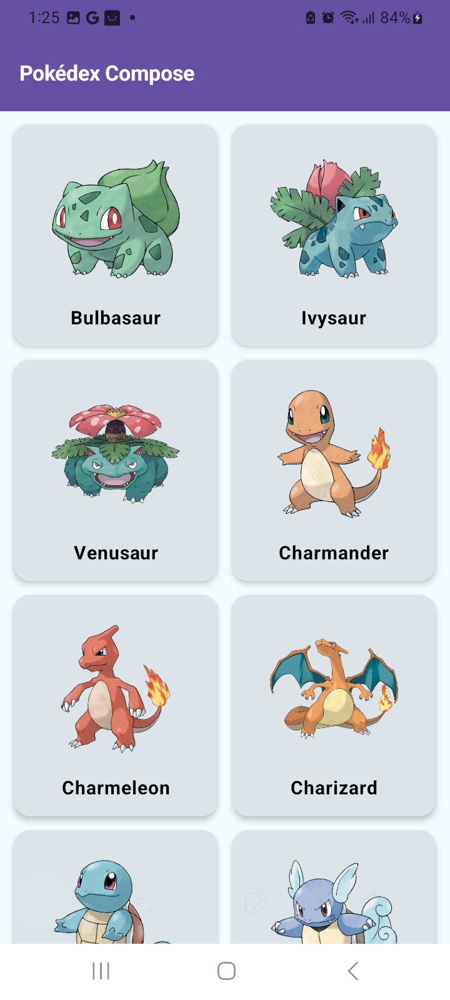
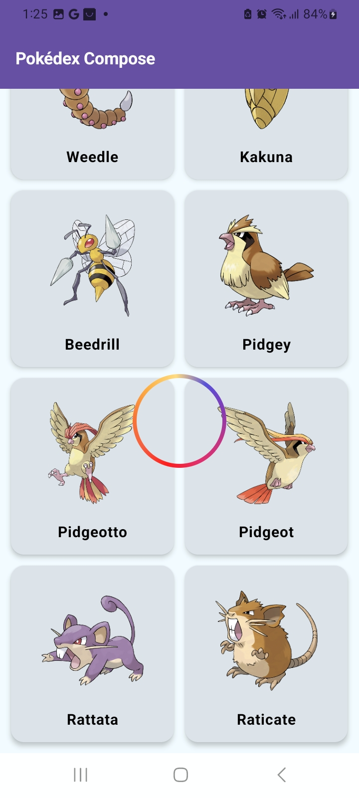

# Pokémon Jetpack Compose
## Ejemplo de App Android con Kotlin, Jetpack Compose, Retrofit y consumo de la API REST de Pokémon

## Architecture

The project uses MVVM architecture pattern.

## Screenshots

||||
|:----:|:----:|
